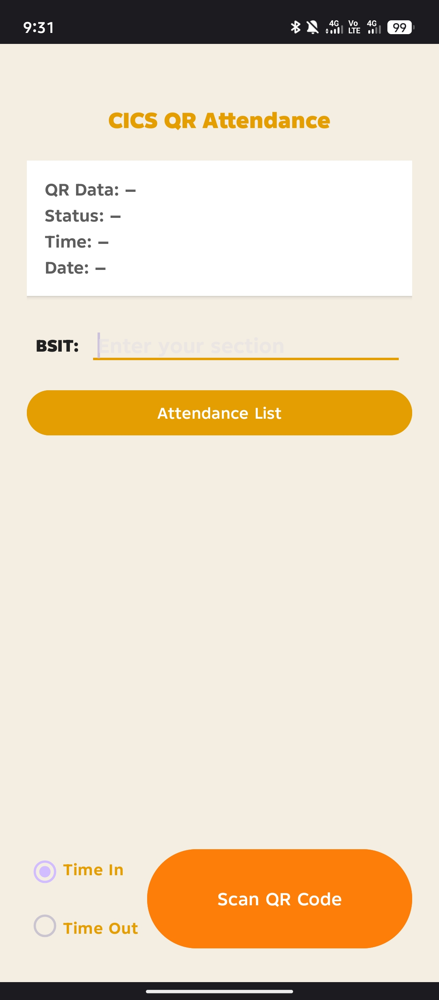
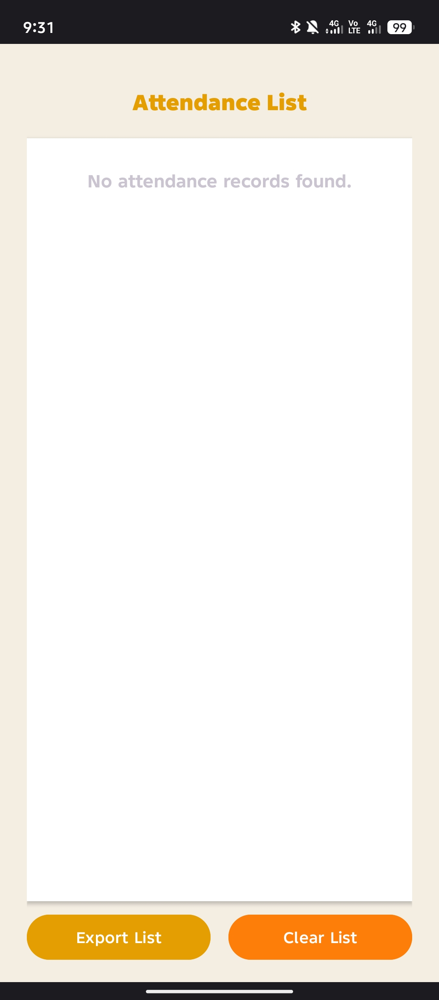

<h1 align="center">CICS QR Attendance Control</h1>

  A simple, offline-ready Android app that records student attendance by scanning QR codes.

  
  
  
  

---

## 📱 Features

- ✅ **Offline attendance tracking**
- 📸 **QR code-based check-in/out**
- ⏱ **Time-in and time-out functionality**
- 🗃 **Local database (SQLite)**
- 📤 **Export attendance to CSV**
- 🧹 **Clear all attendance records**
- 🎨 **Custom UI with light theme and branding colors**
- 🔐 No internet required — fully works offline!

## 🧰 Technologies Used

- **Java**
- **Android Studio**
- **SQLite**
- **Storage Access Framework**
- **ZXing QR scanner (external intent)**

## 📦 APK Download

Click the button below to download the latest APK:

👉 [**Download APK from Releases**](https://github.com/NightCode101/QR_Attendance_Control/releases/latest)

> ⚠ Replace the link with your actual GitHub repo if you plan to publish it.

## 🖼 Screenshots

| Main Menu | Attendance History |
|-----------|--------------------|
|  |  |

## 📧 Contact

For questions, issues, or contributions:

**Jeylo Baoit**  
📬 [baoitjerialle01@gmail.com](mailto:baoitjerialle01@gmail.com)  
🌐 [Facebook Profile](https://fb.com/jeylo.tangaro)

---

## 📝 License

This project is created for educational and academic use.  
Not intended for commercial deployment unless modified with consent.

---

## 🙌 Contributions

Feel free to fork and improve. PRs are welcome!

