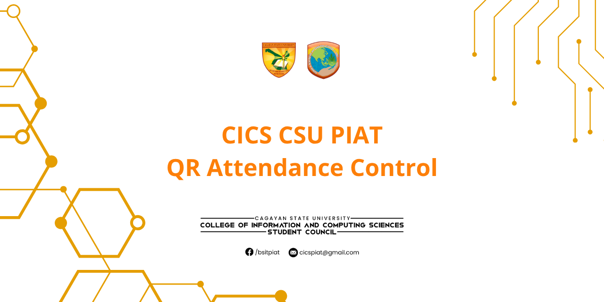
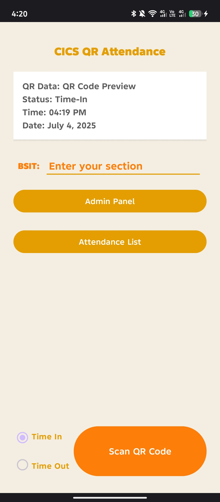
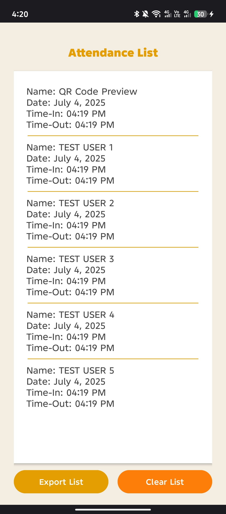
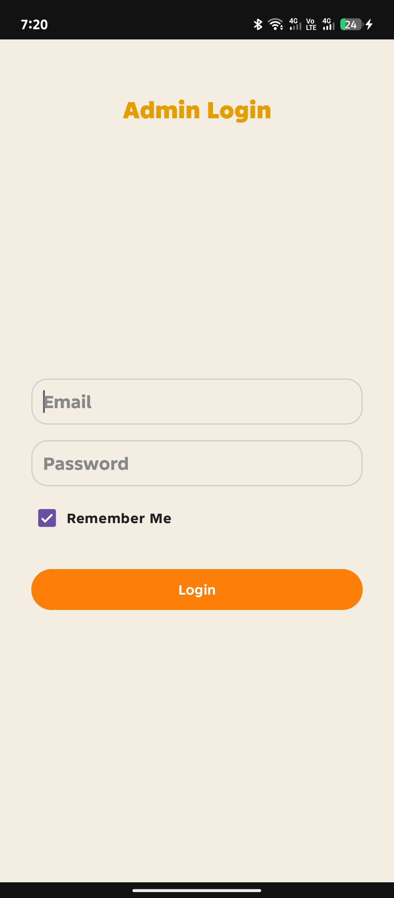
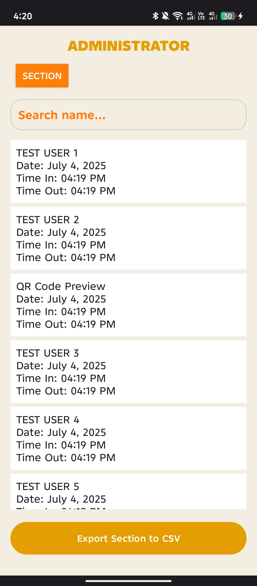

  

<h1 align="center">CICS QR Attendance Control</h1>

  A simple, offline-ready Android app that records student attendance by scanning QR codes.

  
  
  

---

## ✨ Core Features

- 📷 **QR Code Scanner**  
  Scan student-generated QR codes to record attendance instantly.

- 🕒 **Time-In / Time-Out Logic**  
  Smart system to differentiate first scan (Time-In) and second scan (Time-Out) per person per day.

- 📅 **Date & Time Display**  
  Shows the current time and date in 12-hour format with AM/PM.

- 📁 **Offline Mode (SQLite)**  
  All records are stored locally and work without internet access.

- ☁️ **Firebase Sync (Admin Only)**  
  Syncs attendance data to Firestore when online.

- 📤 **Export CSV via Share or File Picker**  
  Export selected attendance as a clean CSV file. You can share it instantly through apps like Gmail or Messenger, or save it using Android's file picker (SAF).

- 📋 **Attendance History View**  
  Displays all scans with clear formatting and spacing.

- 🔐 **Admin Login via Firebase Auth**  
  Only authorized users can access the admin panel using email/password login.

- 🧠 **"Remember Me" Login Option**  
  Saves email and password locally for faster future login.

- 🗑️ **Long Press to Delete**  
  Admins can long-press on a record to delete it from both local UI and Firestore, with an undo option.

- 🎨 **Custom UI Theme**  
  Smooth, clean interface using your own color palette and Material components.

---

## 📱 Features

### 🔐 Admin Panel
- Secure Firebase email/password login
- Multiple admin support via UID checking
- "Remember Me" login toggle
- Access-controlled AdminActivity

### 🧑‍💼 Attendance Management
- QR code scanner for student check-in/out
- Time-in and time-out detection logic
- View and search records by section
- Long-press delete with undo option
- Firebase Firestore sync (admin only)

### 💾 Storage and Export
- Offline-first: all records saved in local SQLite
- Scoped Storage-based CSV export per section
- Automatic file naming with section and date

### 🖌 UI/UX
- Alphabetically sorted section buttons
- Color indicators for selected/unselected buttons
- Custom light theme and branding palette
- Material UI components and spacing

---

## 🧰 Built With

- **Java** (Android SDK)
- **SQLite** (Local Database)
- **Firebase Auth & Firestore** (Admin & Sync)
- **ZXing** (QR Scanner via external intent)
- **Storage Access Framework** (File export)

---

## 📦 APK Download

Click below to grab the latest version:

👉 [**Download APK from Releases**](https://github.com/NightCode101/QR_Attendance_Control/releases/latest)

---

## 🖼 Screenshots

| Main Menu | Attendance History |
|-----------|--------------------|
|  |  |
| Login Menu | Admin Panel |
|  |  |

---

## 📧 Contact

For bugs, questions, or feedback:

**Jeylo Baoit**  
📬 [baoitjerialle01@gmail.com](mailto:baoitjerialle01@gmail.com)  
🌐 [Facebook Profile](https://fb.com/jeylo.tangaro)

---

## 📝 License

This project is intended for academic and educational use.  
Please ask permission if you plan to use this in commercial or institutional settings.

---

## 🙌 Contributions

Pull requests and suggestions are welcome.  
Help improve the system by opening an issue or forking the project.
